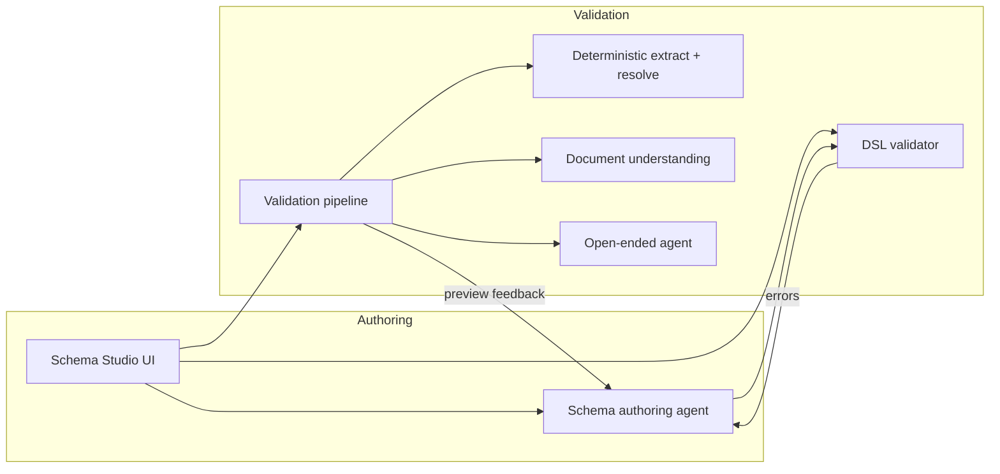

# Schema Studio — deterministic vs agentic validation

Ocean Read separates **what must be true** (deterministic DSL) from **what the document means** (agentic extraction). QA and legal teams define both in one schema; the runtime runs them through the same validation pipeline.

## Two extraction modes

| Mode | DSL location | Outcome | Configuration philosophy |
|------|----------------|---------|---------------------------|
| **Deterministic (strict)** | `fields` + `rules` + `cross_field_rules` | PASS / FAIL / AMBIGUOUS from typed values, ranges, regex, expressions | **Few, guided options** — aliases, label-anchored regex, min/max, `on_ambiguity`, optional `semantic_role` |
| **Agentic (open-ended)** | `open_ended` | Extract + optional evaluate; may be **informative only** (no FAIL) | **Flexible prompts** — `extract_prompt`, `evaluate_prompt`, evidence linking; LLM reads the full PDF context |

Deterministic rules are **hard constraints**: the engine does not invent values. Agentic rules **interpret** the file (layout, tables, prose) and may use document understanding, contextual passes, or alternate PDF tools when the first pass is insufficient.

## Runtime roles (not one “validator”)

1. **DSL validator** — structural checks only (`collect_schema_dsl_errors`). Runs on every draft change and inside the authoring agent repair loop.
2. **Preview run** — same `run_wine_pdf_validation` as production, **without persisting** a run row. Powers “Validate on sample PDF” in the studio.
3. **Schema authoring agent** — turns natural language into JSON; must see **DSL errors** and **preview feedback** to iterate.
4. **Pipeline** — deterministic stages (blocks → candidates → ambiguity policy → field rules) plus optional open-ended LLM evaluation.

### Extraction judge (implemented)

When `extraction.judge_non_regex` is true (default) and `VALIDATION_EXTRACTION_JUDGE_ENABLED` is on, the pipeline asks the LLM to approve layout/LLM/vision winners. Regex is never judged. Rejected picks are removed; notes appear in `extraction_meta.extraction_judge` on preview/validate responses.

### Schema judge + A2A loop (implemented)

After a sample PDF preview, `POST .../schema-judge/analyze` returns structured recommendations. Schema Studio passes these to the authoring agent as `validation_feedback.judge_summary` / `judge_recommendations` (A2A-style loop without a separate microservice yet).

## Schema Studio UI

- **View toggle**: Visual | JSON — same underlying `schema_body`; all DSL options appear in at least one view.
- **Visual editor**: cards per strict field and per open-ended rule; help text on every control; minimal deterministic surface.
- **Sample PDF + Validate**: temporary pipeline run; shows resolved values, failures, ambiguity, open-ended results.
- **Publish**: requires valid JSON + DSL; production runs still use versioned schemas via `POST /api/validate-document`.

## API

| Endpoint | Purpose |
|----------|---------|
| `POST .../validation-schemas/validate-body` | DSL-only check for drafts |
| `POST .../validation-schemas/preview` | DSL + full pipeline on uploaded PDF (no DB run) |
| `POST .../schema-agent/chat` | Agent; optional `validation_feedback` from studio |
| `POST .../schema-judge/analyze` | LLM critique after preview (feeds agent) |

See [`docs/ONBOARDING.md`](../ONBOARDING.md) for running the stack and [`MILESTONE_3_ADVANCED_RULES.md`](../document_validation_docs/02_MILESTONES/MILESTONE_3_ADVANCED_RULES.md) for DSL details.
